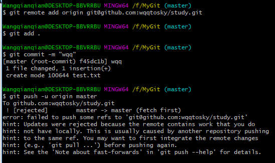
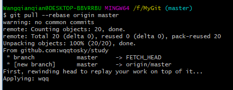
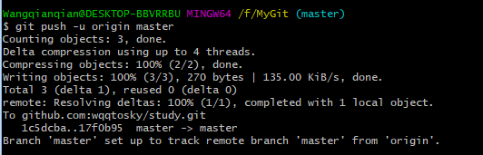

## 如何解决 “failed to push some refs to git ...”

### 问题描述
- 在本地仓库使用git给GitHub远程仓库上传文件时，经过```
git add
.``` ,```git commit -m "--"``` 后,使用```git push origin master```时，出现如下问题。


### 原因
- GitHub远程仓库中的README.md文件不在本地仓库中。

### 解决办法
- 执行```git pull --rebase origin master```命令，将远程仓库的文件```pull```到本地仓库，并且执行合并```merge```。


- 然后可以看到本地仓库文件夹下出现了README.md文件以及远程仓库中的其他文件。
- 执行```git push origin master```命令，继续提交新文件。

 
- 此时，可以在GitHub上看到提交的所有文件了。
