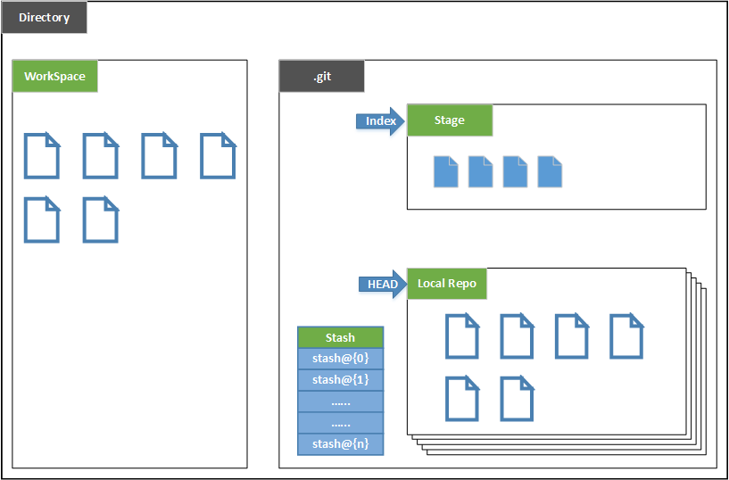
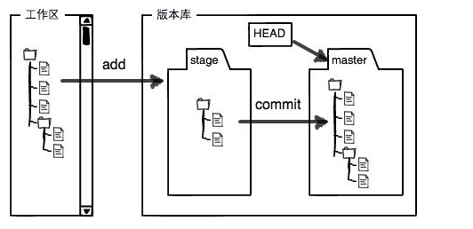
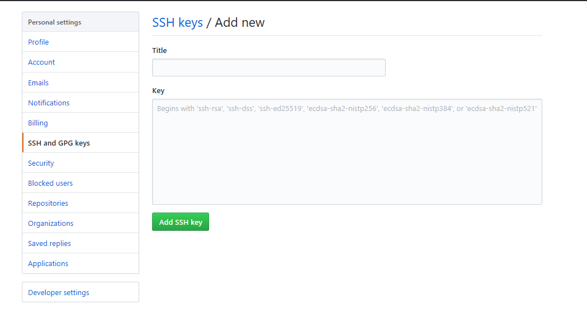
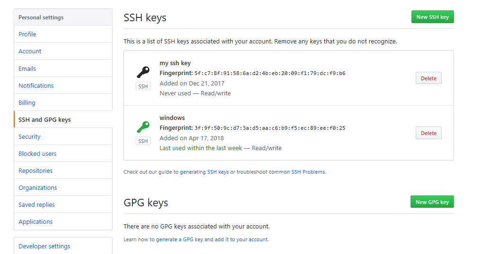

## 前言

- Git是分布式版本控制系统，同一个Git仓库，可以分布到不同的机器上。怎么分布呢？最早，肯定只有一台机器有一个原始版本库，此后，别的机器可以“克隆”这个原始版本库，而且每台机器的版本库其实都是一样的，并没有主次之分。你肯定会想，至少需要两台机器才能玩远程库不是？但是我只有一台电脑，怎么玩？
- 其实一台电脑上也是可以克隆多个版本库的，只要**不在同一个目录**下。不过，现实生活中是不会有人这么傻的在一台电脑上搞几个远程库玩，因为一台电脑上搞几个远程库完全没有意义，而且硬盘挂了会导致所有库都挂掉，所以我也不告诉你在一台电脑上怎么克隆多个仓库。
- 实际情况往往是这样，找一台电脑充当服务器的角色，每天24小时开机，其他每个人都从这个“服务器”仓库克隆一份到自己的电脑上，并且各自把各自的提交推送到服务器仓库里，也从服务器仓库中拉取别人的提交。
- 完全可以自己搭建一台运行Git的服务器，不过现阶段，为了学Git先搭个服务器绝对是小题大作。好在这个世界上有个叫**GitHub**的神奇的网站，从名字就可以看出，这个网站就是提供Git仓库托管服务的，所以，只要注册一个GitHub账号，就可以**免费获得Git远程仓库**。
- 在继续阅读后续内容前，自行注册GitHub账号，并创建一个本地仓库。

## git基本概念
- 在Git中，每个版本库都叫做一个仓库（**repository**），每个**仓库**可以简单理解成一个**目录**，这个目录里面的所有文件都通过Git来实现版本管理，Git都能跟踪并记录在该目录中发生的所有更新。
- 假如我们现在建立一个仓库（repo），那么在建立仓库的这个目录中会有一个"**.git**"的文件夹。这个文件夹非常重要，所有的版本信息、更新记录，以及Git进行仓库管理的相关信息全都保存在这个文件夹里面。所以，不要修改/删除其中的文件，以免造成数据的丢失。
- 下图展示了git中，我们需要了解的一些基本知识（注意，".git"目录中还有很多别的东西，图中并没有涉及，这里也不做解释了）。

- 根据上面的图片，下面给出了每个部分的简要说明：
- **Directory**：**工作区**。使用Git管理的一个目录，也就是一个仓库,包含我们的工作空间和Git的管理空间。
- **WorkSpace**：从仓库中checkout出来的，需要通过Git进行版本控制的目录和文件；这些目录和文件组成了**工作空间**。
- **.git**：存放Git管理信息的目录，初始化仓库的时候自动创建，它是Git的版本库。
- **Index/Stage**：暂存区，或者叫做待提交更新区；在提交进入repo之前，我们可以把所有的更新放在暂存区。
- **Local Repo**：本地仓库，一个存放在本地的版本库；HEAD会指示当前的开发分支（branch）。
- **Stash**：是一个工作状态保存栈，用于保存/恢复WorkSpace中的临时状态。

> Git的版本库里存了很多东西，如下图所示。其中最重要的就是称为`stage`（或者叫index）的暂存区，还有Git为我们自动创建的第一个分支`master`，以及指向`master`的一个指针叫`HEAD`。
>
>我们把文件往Git版本库里添加的时候，是分两步执行的：
第一步是用`git add`把文件添加进去，实际上就是把文件修改添加到暂存区；
第二步是用`git commit`提交更改，实际上就是把暂存区的所有内容提交到当前分支`HEAD`。

 - 

## git相关操作命令
+ 创建本地仓库：`git init`
  - 首先在选择一个合适的地方，创建一个空目录。在windows系统上，确保目录名不包含中文。
  - 通过`git init`命令把上面的目录变成Git可以管理的仓库。此时在当前目录下多了一个`.git`的目录。
  - 这时本地仓库就创建完成了，需要添加到版本库的文件需要提前放进当前目录或子目录。
+ 创建远程仓库
  - 使用GitHub作为远程仓库时，由于本地Git仓库和GitHub仓库之间的传输是通过SSH加密的，所以，需要一点设置：
   -  创建SSH Key。在用户主目录下（windows系统，可能生成在C盘），看看有没有`.ssh`目录，如果有，再看看这个目录下有没有`id_rsa`和`id_rsa.pub`这两个文件，如果已经有了，可直接跳到下一步。如果没有，打开`Shell`（Windows下打开Git Bash），创建`SSH Key`：
   ```
   ssh-keygen -t rsa -C "youremail@example.com"
   ```
   - 登陆GitHub，打开“settings”，“SSH And GPG Keys”页面，然后，点“Add new SSH Key”，填上任意Title，在Key文本框里粘贴`id_rsa.pub`文件的内容：
   - 
   - 点“Add SSH Key”，你就应该看到已经添加的Key：
   - 
  - 本地添加远程仓库：
    -  使用下面的命令与GitHub上的远程仓库关联：
    ```
    git remote add origin git@server-name:path/repo-name.git
    ```
    - 添加后，远程库的名字就是origin，这是Git默认的叫法，也可以改成别的，但是origin这个名字一看就知道是远程库。
    - 下一步，就可以把本地库的所有内容推送到远程库上：
    ```
    git push -u origin master
    ```
    - 由于远程库是空的，我们第一次推送`master`分支时，加上了`-u`参数，Git不但会把本地的`master`分支内容推送的远程新的`master`分支，还会把本地的`master`分支和远程的`master`分支关联起来，在以后的推送或者拉取时就可以简化命令。
    - 也可以更改分支`master`的名字，给其他分支推送内容。
  - 克隆远程仓库：
    -  当GitHub仓库创建完成后，就可以使用下面的命令克隆一个本地库：
    ```
    git clone git@server-name:path/repo-name.git
    ```
    - GitHub给出的地址不止一个，还可以用https://..这样的地址。实际上，Git支持多种协议，默认的git://使用ssh，但也可以使用https等其他协议。
    - Git支持多种协议，包括https，但通过ssh支持的原生git协议速度最快。
